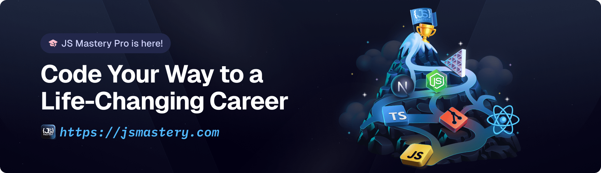

Follow these steps to set up the project locally on your machine.

**Prerequisites**

Make sure you have the following installed on your machine:

- **[Git](https://git-scm.com/)**
- **[Node.js](https://nodejs.org/en)**
- **[npm](https://www.npmjs.com/)** _(Node Package Manager)_

**Cloning the Repository**

```bash
git clone https://github.com/adrianhajdin/food_ordering.git
cd food_ordering
```

**Installation**

Install the project dependencies using npm:

```bash
npm install
```

**Set Up Environment Variables**

Create a new file named `.env` in the root of your project and add the following content:

```env
EXPO_PUBLIC_APPWRITE_PROJECT_ID=
EXPO_PUBLIC_APPWRITE_ENDPOINT=
```

Replace the placeholder values with your actual credentials by signing up on the **[Appwrite](https://jsm.dev/rn25-appwrite)** dashboard.

**Running the Project**

```bash
npx expo start
```

Open your ExpoGO app on your phone and scan the QR code to view the project.

## <a name="links">🔗 Assets</a>

Assets and snippets used in the project can be found in the **[video kit](https://jsmastery.com/video-kit/d6633345-8797-4b96-8a4b-935618306d1d)**.

<a href="https://jsmastery.com/video-kit/d6633345-8797-4b96-8a4b-935618306d1d" target="_blank">
  
</a>

## <a name="more">🚀 More</a>

**Advance your skills with Next.js Pro Course**

Enjoyed creating this project? Dive deeper into our PRO courses for a richer learning adventure. They're packed with

detailed explanations, cool features, and exercises to boost your skills. Give it a go!

<a href="https://jsm.dev/rn-food-jsm" target="_blank">
   
</a>
